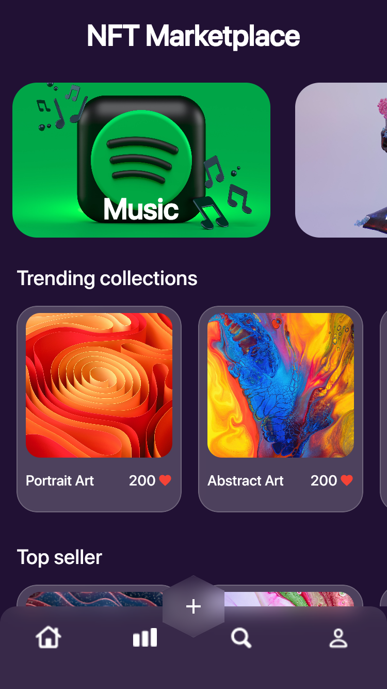
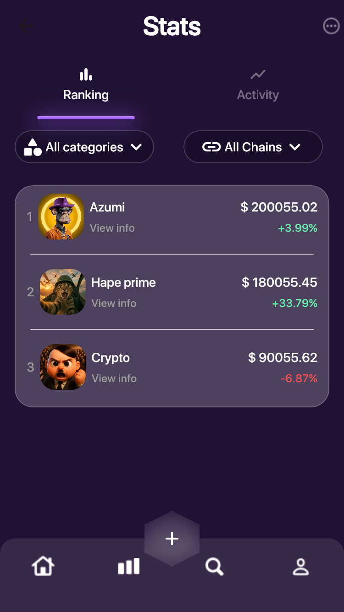

```markdown
# 🖼 NFT Market

A sample NFT marketplace app built with **Flutter** using **Provider** for state management.

## 📌 Features
- Display a list of NFTs with image, name, and price
- View NFT details
- Add NFTs to favorites
- State management with **Provider**
- Responsive design for mobile and tablet
- Sample data provided via JSON

## 🛠 Technologies
- **Flutter** (SDK: 3.x.x)
- **Provider** for state management
- **Dart**
- **JSON** for mock data

## 🚀 Getting Started
1. Clone the repository:
```bash
git clone https://github.com/USERNAME/nft-market.git
````

2. Navigate to the project folder:

```bash
cd nft-market
```

3. Install dependencies:

```bash
flutter pub get
```

4. Run the project:

```bash
flutter run
```

## 📸 Screenshots

*(assets/readme/screenshot.jpg)*

| Home Screen                   | Details Screen                      |
| ----------------------------- | ----------------------------------- |
|  |  |
